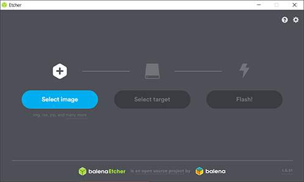
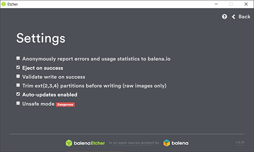
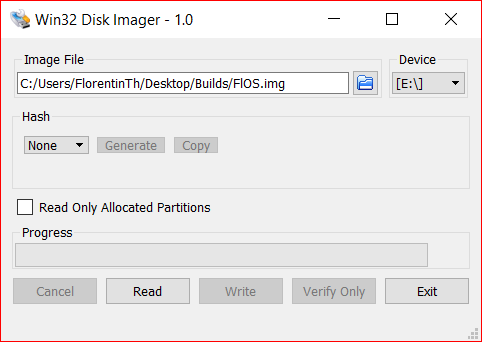

# How to Bake FlOS

Since the Debian team have release a minimal version of Debian 10 - Buster specific for the Raspberry Pi that is ARMv8 compatible, the first step is to download the latest version of this distribution that is available [here](https://people.debian.org/~gwolf/raspberrypi/). Such image can then be flashed on the SD card with the [Etcher](https://www.balena.io/etcher/) tool.



**To avoid possible issues, you need to tune Etcher settings accordingly :**



---
**Credentials :**

- username : **root**
- password : **raspberry**

---

## 1. Prerequisites

- Update the system :

```bash
> apt-get update && apt-get dist-upgrade -y
```

- Install required tools :

```bash
> apt install plymouth -y
```

- Edit the ```cmdline.txt``` file :

```bash
> nano /boot/firmware/cmdline.txt
```

- Edit existing entry and insert new one :

```nginx
# edit console=tty0 by
console=tty1
# insert loglevel after console parameter :
loglevel=3
```

## 2. System Preferences

- Install required packages :

```bash
> apt-get install -y \
    locales keyboard-configuration \
    console-setup console-data
```

- Setup default locale :

```bash
> dpkg-reconfigure locales
```

- Setup default keyboard configuration :
  
```bash
> dpkg-reconfigure keyboard-configuration

# Restart the service :
> service keyboard-setup restart
```

- Setup de default timezone :

```bash
> timedatectl set-timezone America/Montreal

# To obtain a list of all timezones, you can use the following command :
> timedatectl list-timezones
```

- Setup default hostname :

```bash
> hostnamectl set-hostname <your_hostname>

> nano /etc/hosts

# Add the following line at the end of the file :
127.0.1.1   <your_hostname>
```

## 3. Network

- Install required packages :
  
```bash
> apt-get install -y net-tools dhcpcd5

```

- Create Wi-Fi configuration file :

```bash
> nano /etc/wpa_supplicant/wpa_supplicant.conf
```

- Past following configuration :

```nginx
ctrl_interface=DIR=/var/run/wpa_supplicant GROUP=netdev
update_config=1
## Change the code of the country.
country=CA

network={
        ssid=""
        ## Uncomment if SSID is hidden
        # scan_ssid=1
        psk=""
}
```

- Edit ```dhcpcd``` configuration :

```bash
> nano /etc/dhcpcd.conf
```

```nginx 
## uncomment following line :
clientid

## comment following line :
# duid
```

- Edit ```dhclient``` configuration :

```bash
> nano /etc/dhcp/dhclient.conf
```

```nginx
## Uncomment and edit following line :
timeout 10;
```

- Enable ```wpa_supplicant``` :
  
```bash
> ln -s \
    /usr/share/dhcpcd/hooks/10-wpa_supplicant \
    /usr/lib/dhcpcd/dhcpcd-hooks/

> wpa_supplicant -B -i wlan0 \
    -c /etc/wpa_supplicant/wpa_supplicant.conf

> dhcpcd wlan0
```

- Disable IPv6 for all network interfaces :
  
```bash
> nano /etc/sysctl.conf

# insert the following line at the end of the file :
net.ipv6.conf.all.disable_ipv6 = 1

# apply changes :
> sysctl -p
```

## 4. Swap

- Install required packages :

```bash
> apt-get install -y dphys-swapfile
```

- Setup default swap size :
  
```bash
> nano /etc/dphys-swapfile

# Uncomment and edit following line :
CONF_SWAPSIZE=60

# Restart the service :
> /etc/init.d/dphys-swapfile stop
> /etc/init.d/dphys-swapfile start
```

## 5. Users

- Install required packages :

```bash
> apt-get install -y sudo
```

- Change root password :

```bash
> passwd
```

- Edit ```profile``` configuration file :

```bash
> nano /etc/profile
```

```nginx
if [ "`id -u`" -eq 0 ]; then
  PATH="/usr/local/sbin:/usr/local/bin:/usr/sbin:/usr/bin:/sbin:/bin"
else
  PATH="/usr/local/sbin:/usr/local/bin:/usr/sbin:/usr/bin:/bin:/usr/local/games"
fi
```

- Create new default user :

```bash
> adduser <username>

> usermod <username> -aG sudo,users,netdev,docker
```

## 6. Customization

- Install required packages :

```bash
> apt-get install -y lsb-release figlet
```

- Remove default MOTD related files :

```bash
> rm /etc/motd
> rm /etc/update-motd.d/*
```

- Download new default MOTD files :

```bash
> curl -sSL https://bit.ly/2OCHlgu \
    -o /etc/update-motd.d/00-header

> curl -sSL https://bit.ly/2GAJ2Va \
    -o /etc/update-motd.d/10-sysinfo

> curl -sSL https://bit.ly/313KE1f \
    -o /etc/update-motd.d/90-footer
```

- Make these files executable :
  
```bash
> chmod +x /etc/update-motd.d/*
```

- Edit new default user ```.bashrc``` file :

```bash
> nano /home/<username>/.bachrc
```

- Insert following lines at the end of the file :

```bash
if [ -f ~/.bash_profile ]; then
    . ~/.bash_profile
fi
```

- Download new custom ```.bash_profile``` file for both root ad new user :

```bash
> curl -sSL https://bit.ly/332BuDZ \
    -o /root

> cp /root/.bash_profile /home/<username>

> chown <username>:<username> \
    /home/<username>/.bash_profile
```


## 7. Docker

### 7.1. Install Docker Engine

- Install required packages :

```bash
> apt-get install -y \
    apache2-utils python python-dev python-pip \
    libffi-dev apt-transport-https ca-certificates \
    build-essential libssl-dev curl gnupg2 \
    software-properties-common
```

- Run following commands :

```bash
> curl -sSL https://get.docker.com -o /tmp/get.docker.com

> chmod +x /tmp/get.docker.com

> /tmp/get.docker.com

> newgrp docker
```

- Remove useless packages :

```bash
> apt-get remove python-configparser
```

### 7.2. Install ```docker-compose```

- Update possibly out of date setuptools package :

```bash
> pip install --upgrade setuptools
```

- Then, ```docker-compose``` through ```pip``` :

```bash
> pip install docker-compose
```

## 8. Overclocking

- Edit the following configuration file :

```bash
> nano /boot/firmware/config.txt
```
- Add following lines at the end of the file :

```nginx
arm_freq=1000
core_freq=500
sdram_freq=400
over_voltage=0
over_voltage_sdram_p=0
over_voltage_sdram_i=0
over_voltage_sdram_c=0
```

## 9. Resize FS

- Execute the following commands :

```bash
> curl -sSL https://bit.ly/2YzCrAB \
    -o /usr/lib/resize-fs

> chmod +x /usr/lib/resize-fs

> curl -sSL https://bit.ly/2YFyEG0 \
    -o /lib/systemd/system/resize-fs.service

> chmod 644 /lib/systemd/system/resize-fs.service

> systemctl daemon-reload

> systemctl enable resize-fs.service
```

## 10. Clean Up

- Execute the following commands :

```bash
> apt-get autoremove -y

> apt-get clean

> truncate -s 0 /root/.bash_history /home/<username>/.bash_history

> history -c
```

## 11. Copy the SD Card

In order to obain an image of your custom OS, you first need to copy the entire SD card content as a ```.img``` file. To do so, you can use [Win32DiskImager](https://sourceforge.net/projects/win32diskimager/) if you are on Windows :



You will first have to setup a path to a non-existing image and select the device corresponding to your SD card. Then click the **read** button.

If you are on Linux, you will first have to identify where your device corresponding to your SD card is mounted in :

```bash
$ sudo fdisk -l

# Example of output
Device         Boot   Start      End  Sectors  Size Id Type
/dev/mmcblk0p1 *       2048  2099199  2097152    1G  c W95 FAT32 (LBA)
/dev/mmcblk0p2      2099200 31116287 29017088 13.9G 83 Linux
```

Then to copy the whole content of the SD card, you first need to unmount the device :

```bash
$ sudo umount /dev/mmcblk0
```

Finally copy the content of the device through the following command :

```bash
$ sudo dd if=/dev/mmcblk0 of=/home/<username>/sd-card-copy.img
```

_Make yourself a coffee this step may take several time !_

> **The resulting image will have the same size as the capacity of your SD card. Make sure that you have enough disk space to store it temporarily. It is preferable to use a smaller capacity SD card such as 8Go that should be a good fit.**

## 12. Shrink the Image

> To achieve this step on Windows, it is recommended to use a Linux virtual machine and transfer the resulting image of the SD card copy from your host to the VM _and vice versa_ through ```scp```.

- On a Linux environment, the first step is to install [PiShrink](https://github.com/Drewsif/PiShrink) :

```bash
$ sudo curl -sSL https://raw.githubusercontent.com/Drewsif/PiShrink/master/pishrink.sh -o /usr/local/bin

$ sudo chmod +x /usr/local/bin/pishrink.sh
```

- Then shrink your image as follows :

```bash
$ sudo  pishrink.sh sd-card-copy.img sd-card-copy-small.img
```

_The smaller resulting image is now ready to be flash any time on any sd card !_